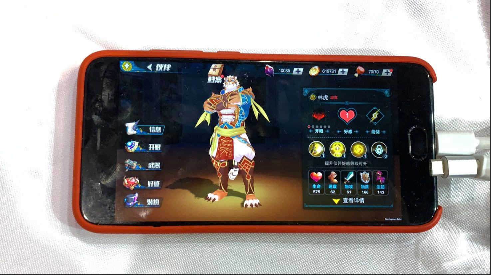
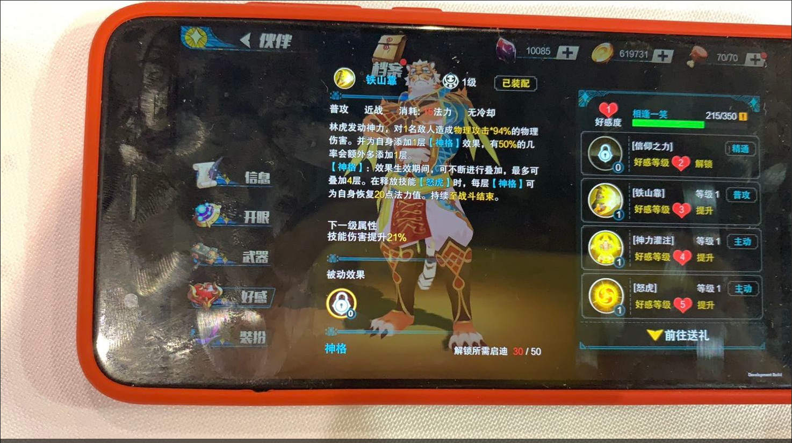

# 蓋伊傳說

## 藏寶圖 - 寶箱位置及可獲得之啟迪與數量

### 各地圖可取得啟迪對應數應&數量

地圖 | 隨機獲得啟迪(數量) | 必定獲得
--- | --- | ---
森林 | 冰霜(4) 神聖(7) 狂暴(10)| 蓋伊萬能啟迪(7)
工廠 | 閃電(7) 魂祭(10) 戰術(4) | 蓋伊萬能啟迪(7)
圖書館 | 火焰(10) 靈誡(4) 防護(4) | 蓋伊萬能啟迪(7)

### 地圖寶箱位置參考

## 家有大貓 - 合作蓋伊

### 林虎

> [Source](https://forum.gamer.com.tw/C.php?bsn=36399&snA=486&tnum=3)
